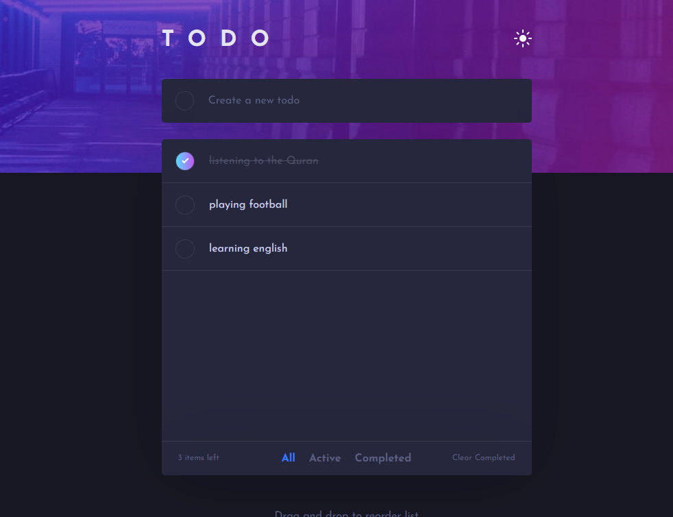

# Frontend Mentor - Todo app solution

This is a solution to the [Todo app challenge on Frontend Mentor](https://www.frontendmentor.io/challenges/todo-app-Su1_KokOW). Frontend Mentor challenges help you improve your coding skills by building realistic projects.

## Table of contents

- [The challenge](#the-challenge)
- [Screenshot](#screenshot)
- [Links](#links)
- [My process](#my-process)
  - [Built with](#built-with)
  - [What I learned](#what-i-learned)
- [Author](#author)

### The challenge

Users should be able to:

- View the optimal layout for the app depending on their device's screen size
- See hover states for all interactive elements on the page
- Add new todos to the list
- Mark todos as complete
- Delete todos from the list
- Filter by all/active/complete todos
- Clear all completed todos
- Toggle light and dark mode
- **Bonus**: Drag and drop to reorder items on the list

### Screenshot



### Links

- Solution URL: [https://github.com/ahmedaqilah94/Todo-app]()
- Live Site URL: [https://ahmedaqilah94.github.io/Todo-app/]()

### Built with

- Semantic HTML5 markup
- CSS custom properties
- Flexbox
- CSS Grid
- Mobile-first workflow
- JS library
- Sass
- Vite

### What I learned

```css
.checkbox {
  width: 20px;
  height: 20px;
  border: solid 1px var(--border-color);
  border-radius: 50%;
  transition: var(--transition-time);

  &:hover {
    background-image:
      linear-gradient(var(--bg-tasks-color)), var(--bg-linear-gradient);
    background-origin: border-box;
    background-clip: content-box, border-box;
    border: 1px solid transparent;
  }
  &.checked {
    background:
      url(./images/icon-check.svg) no-repeat,
      var(--bg-linear-gradient);
    background-position: center;
  }
}
```

```js
const saveTasksMovementToDataB = () => {
  let tasks = [];
  getTasksElement().forEach((element) => {
    const taskValue = element.textContent.trim();
    const taskId = element.id;
    const taskIsCompleted =
      element.firstElementChild.classList.contains("checked");
    const task = {
      value: taskValue,
      isCompleted: taskIsCompleted,
      id: taskId,
    };
    tasks.push(task);
  });
  saveToDataB("tasks", tasks);
};

taskListElement.addEventListener("dragover", (e) => {
  e.preventDefault();
  const targetTask = e.target.closest(".task");
  if (!targetTask) return;
  const rect = targetTask.getBoundingClientRect();
  const middle = rect.top + rect.height / 2;
  if (e.clientY < middle) {
    taskListElement.insertBefore(draggedTask, targetTask);
    draggedTask.classList.add("dragging");
  } else {
    taskListElement.insertBefore(draggedTask, targetTask.nextSibling);
    draggedTask.classList.add("dragging");
  }
  saveTasksMovementToDataB();
});
taskListElement.addEventListener("drop", () => {
  draggedTask.classList.remove("dragging");
});
```

### Useful resources

- [Almadrasa](https://www.almdrasa.com/) - This is an amazing deploma which helped me finally understand HTML CSS JS .

## Author

- Github - [Ahmed Aqilah](https://github.com/ahmedaqilah94)
- Frontend Mentor - [@ahmedaqilah94](https://www.frontendmentor.io/profile/ahmedaqilah94)
